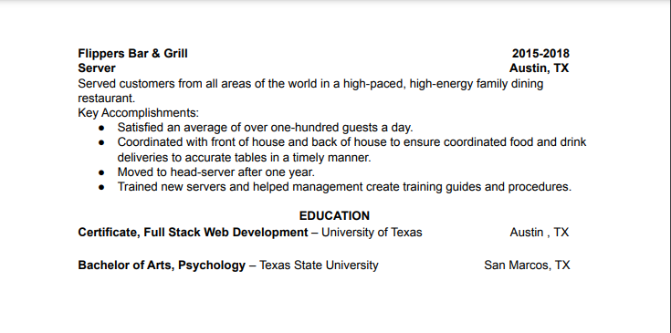

# Bootcamp Resources

## Purpose
A list of resources that is useful for Coding Boot Camp.

## Table of Contents

- [Git](#git)
- [VSCode](#vs-code)
- [ReadMe and Licensing](#readme-and-licensing)
- [HTML](#html)
- [CSS](#css)
- [JavaScript](#javascript)
- [SQL](#sql)
- [NoSQL](#nosql)
- [Algorithms and Data Structures](#algorithms-and-data-structures)
- [Demo Sites](#demo-sites)
- [Career Advice](#career-advice)
- [Practicing Coding Skills](#practicing-coding-skills)
- [Games](#games)
- [Coding Terms](#coding-terms)
- [Podcasts](#podcasts)

## Git

### Learn Git Branching
https://learngitbranching.js.org/

### Git Cheat Sheet

### Git Cherry Pick
https://git-scm.com/docs/git-cherry-pick

### Git Cheat Sheet – 50 Git Commands You Should Know
https://www.freecodecamp.org/news/git-cheat-sheet/

### The Mac Terminal Commands Cheat Sheet
https://www.makeuseof.com/tag/mac-terminal-commands-cheat-sheet/

### Generating a new SSH key and adding it to the ssh-agent - GitHub Docs
https://docs.github.com/en/authentication/connecting-to-github-with-ssh/generating-a-new-ssh-key-and-adding-it-to-the-ssh-agent

## VS Code

### Running Visual Studio Code on macOS
https://code.visualstudio.com/docs/setup/mac

### indent-rainbow - Visual Studio Marketplace
https://marketplace.visualstudio.com/items?itemName=oderwat.indent-rainbow

### Bracket Pair Colorizer 2 - Visual Studio Marketplace
https://marketplace.visualstudio.com/items?itemName=CoenraadS.bracket-pair-colorizer-2

## ReadMe and Licensing

### ReadMe Syntax
https://markdown-it.github.io/

### Licensing a repository - GitHub Docs
https://docs.github.com/en/repositories/managing-your-repositorys-settings-and-features/customizing-your-repository/licensing-a-repository

### Markdown License badges
https://gist.github.com/lukas-h/2a5d00690736b4c3a7ba

### Open Source Licenses by Category
https://opensource.org/licenses/category

### Web Accessibility Initiative (WAI)
https://www.w3.org/WAI/standards-guidelines/wcag/

### BleepingComputer
https://www.google.com/amp/s/www.bleepingcomputer.com/news/security/dev-corrupts-npm-libs-colors-and-faker-breaking-thousands-of-apps/amp/

## HTML

### HTML in 100 Seconds 
https://www.youtube.com/watch?v=ok-plXXHlWw

## CSS

### Learn CSS Position In 9 Minutes
https://www.youtube.com/watch?v=jx5jmI0UlXU

### CSS-Tricks
https://css-tricks.com/almanac/properties/p/position/

### CSS-Position Property parent-child relation 

### CSS in 100 Seconds
https://www.youtube.com/watch?v=OEV8gMkCHXQ

### Website wireframe
https://en.wikipedia.org/wiki/Website_wireframe

## JavaScript

### JavaScript and JQuery: Interactive Front-End Web Development
https://www.amazon.com/JavaScript-JQuery-Interactive-Front-End-Development/dp/1118531647

### JavaScript the Hard Parts: Closure, Scope & Execution Context
https://www.youtube.com/watch?v=XTAzsODSCsM&amp;ab_channel=Codesmith

### JavaScript Algorithms and Data Structures Masterclass
https://www.udemy.com/course/js-algorithms-and-data-structures-masterclass/

## SQL

### MySQL Installation Guide
https://coding-boot-camp.github.io/full-stack/mysql/mysql-installation-guide

### Customizing the PATH for MySQL Tools
https://dev.mysql.com/doc/mysql-windows-excerpt/5.7/en/mysql-installation-windows-path.html

### Getting Information About Databases and Tables
https://dev.mysql.com/doc/refman/8.0/en/getting-information.html

### Loading Data into a Table
https://dev.mysql.com/doc/refman/8.0/en/loading-tables.html

### Many-to-Many Associations
https://gist.github.com/elliette/20ddc4e827efd9d62bc98752e7a62610

### Postgres & Sequelize - Associations
https://www.youtube.com/watch?v=A1dAHmzpcX0

## NoSQL

### mongodb-community not working on Apple M1
https://stackoverflow.com/questions/69943888/mongodb-community-not-working-on-apple-m1

### Troubleshoot Connection Issues
https://www.mongodb.com/docs/atlas/troubleshoot-connection/#special-characters-in-connection-string-password

## Algorithms and Data Structures

### Beginner Data Structures Explained Like You Are 5
https://www.youtube.com/watch?v=o6VuST08S60

### Regex101
https://regex101.com/r/cO8lqs/24

### RegExr: Learn, Build, & Test RegEx
https://regexr.com/

### Visualizing Recursive Fibonacci Algorithm
https://observablehq.com/@victormutai/visualizing-recursive-fibonacci-algorithm

## Demo Sites

### Postman API Platform | Sign Up for Free
https://www.postman.com/

### HTML, CSS and JavaScript demo - Liveweave
https://liveweave.com/

### Code Pen
https://codepen.io/pen/?editors=0011

### JSFidde
https://jsfiddle.net/

## Career Advice

### Past Seminars from 2U Career Network
https://careernetwork.2u.com/all-events/?industry=web-development&event_type=past&event_period=#results

### BCS Tools and Resources 
https://careernetwork.2u.com/tools-and-resources/?utm_medium=BCSMilestones&utm_source=boot_camp

### Getting a good job is easy Part 1: Get Noticed
https://imgur.com/gallery/Q89Wo

### OCS Resumes and Cover Letters
https://ocs.fas.harvard.edu/files/ocs/files/undergrad_resumes_and_cover_letters.pdf?m=1598037165

### Sample Resume Template

### How Long Should Your Resume Be in 2021 (Expert Advice)
https://www.zipjob.com/blog/how-long-your-resume-should-be/#:~:text=a%20recent%20graduate.-,When%20should%20your%20resume%20be%20two%20pages%3F,and%20skills%20on%20your%20resume

### 482 hiring managers looked at nearly 20,000 résumés and found the classic advice to limit your résumé to one page might be wrong after all
https://www.businessinsider.com/resume-length-two-pages-or-one-2018-11

### Top Companies 2022: The 50 best workplaces to grow your career in the U.S.
https://www.linkedin.com/pulse/top-companies-2022-50-best-workplaces-grow-your-career-us-/

## Practicing Coding Skills

### Hacker Rank
https://www.hackerrank.com/

### Code Wars
https://www.codewars.com/

### Code Signal
https://codesignal.com/

### Interview Bit
https://www.interviewbit.com/

### Leet Code
https://leetcode.com/

### NeetCode
https://neetcode.io/

### Pramp by Exponent
https://www.pramp.com/#/

### New Year Gift - Curated List of Top 75 LeetCode Questions to Save Your Time
https://www.teamblind.com/post/New-Year-Gift---Curated-List-of-Top-100-LeetCode-Questions-to-Save-Your-Time-OaM1orEU

## Games

### Flexbox Froggy
https://flexboxfroggy.com/

### Grasshopper: Learn to Code
https://apps.apple.com/us/app/grasshopper-learn-to-code/id1354133284

## Coding Terms

### Hackterms
https://www.hackterms.com/

### Scope
https://developer.mozilla.org/en-US/docs/Glossary/Scope

### Functions
https://developer.mozilla.org/en-US/docs/Web/JavaScript/Guide/Functions

### 'this' keyword
https://developer.mozilla.org/en-US/docs/Web/JavaScript/Reference/Operators/this

### '==' and '==='
https://developer.mozilla.org/en-US/docs/Web/JavaScript/Equality_comparisons_and_sameness

## Podcasts

### Software Developer's Journey
https://open.spotify.com/show/3PFgIWqoWYiz4c85m10LVa?si=b5b7373b803c4e2e

### Syntax - Tasty Web Development Treats
https://open.spotify.com/show/4kYCRYJ3yK5DQbP5tbfZby?si=3ce282af63134dff

### A Question of Code 
https://open.spotify.com/show/4Xr1cxpiCMOHqyP0XIme4k?si=4a2e0dcf4d7c4449

### Learn to Code With Me
https://open.spotify.com/show/6Pz9YOO4XJAL2DRt7RauI3?si=70419363e99048fc

### Front End Happy Hour
https://open.spotify.com/show/0Giuw6eNbTzP9CDZODDrA2?si=2cc6cd4b98774422

### CS50 Lectures 2020
https://www.youtube.com/playlist?list=PLhQjrBD2T382_R182iC2gNZI9HzWFMC_8

### Front End Mock Technical Interview | JavaScript, CSS, React, and Algorithms
https://www.youtube.com/watch?v=vomuCMmoNyE

## Contribution
Made by Bootcamp: CU-VIRT-BO-FSF-PT-12-2021-U-B-TTH class
